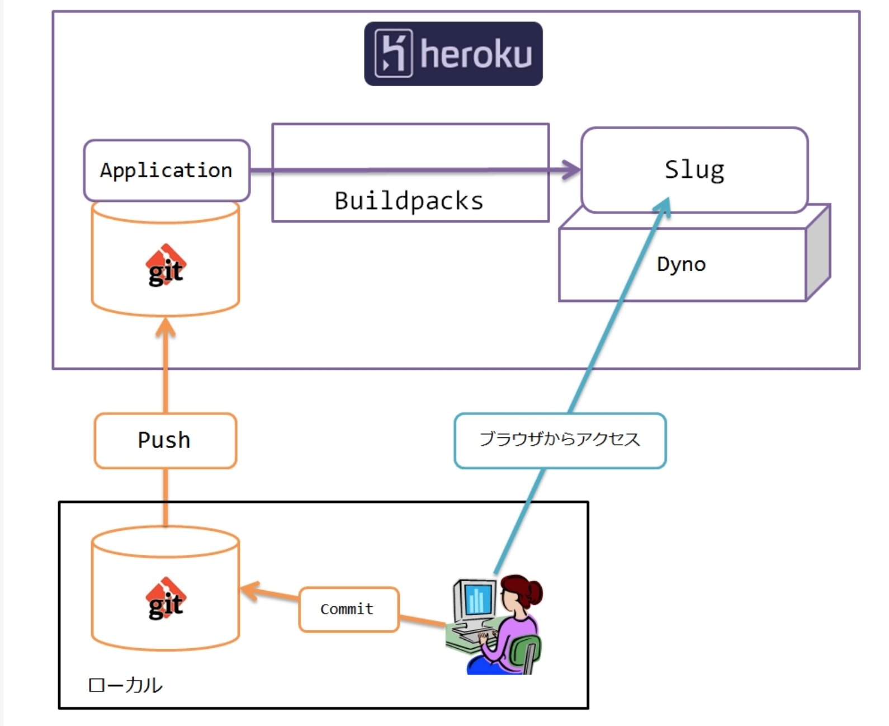

# Herokuについての備忘録
## Herokuとは
herokuは自動的にデプロイするのに必要なものを用意してくれるもので、PaaS(Platform as a service)の一種。要はPlatformをサービスとして出しているというもの

## Platformとは
Platformとは足場っていう意味。ソフトウェアからみたプラットフォームはOSで、OSからみたプラットフォームはCPUやメモリなどのハードウェアなどにあたる

## 用語
### Slug
herokuで実行するために必要なファイルをかき集めてビルド、パッケージングして圧縮したもの。以下のものをまとめたものをslugという。
- ソースコードをビルドしてできた実行ファイル
- 依存するライブラリ一式
- 言語の実行環境  
  

### Buildpacks
- Slugを構築する方法を定義したスクリプト
- 標準では、phpとかrubyとかnode.jsなど様々なbuildpackが用意されている。
- これが原因でhtmlとかcssとかjsだけのプロジェクトのときにはphpのファイルで読み込む必要がある

### Dyno
SlugはDynoと呼ばれる仮想のUnixコンテナにデプロイされ実行される。アプリケーションを実行するためのサーバやOS、DBなどのプラットフォームと呼ばれる部分をネット越しに使えるようにする

## デプロイ(運用)までの流れ
流れとしては、heroku上のgitのディレクトリにpushされたものを検知して、それに対してwebpackがその内容をslugに変換してそれをdynoにのっけるイメージ。  
以下の図みたいな流れ  

## Herokuの使い方
herokuでなにかデプロイしたいときには、
herokuのhpでユーザの登録を終わらせる

1. アップロードしたいディレクトリをgit initする  
`brew install heroku`

2. もしhtml,css,jsだけのアプリだったらディレクトリにindex.phpを追加してその中身を以下に書き換える。こうすることでindex.htmlがきちんと読み込まれるようになる  
`<?php include_once("index.html"); ?>`

3. herokuにlogin  
`heroku login`  

4. 作業ディレクトリ内の変更を次のコミットに備えてステージングエリアに追加  
`git add .`  

5. commitするときのステージングエリアにある内容をlocal repositoryに追加  
`git commit -m "messageをここに追加する"`  

6. herokuでアプリ専用のプロジェクト(git repository)を自分のherokuの環境に作成。これによって、デプロイ先を作るイメージ。  
`heroku create プロジェクト名`  

7. 作成したプロジェクトのgit repositoryにmaster branchにある内容をpushする  
`git push heroku master`  

8. デプロイがし終わったアプリは以下のコマンドでによって見ることができる  
`heroku open`
